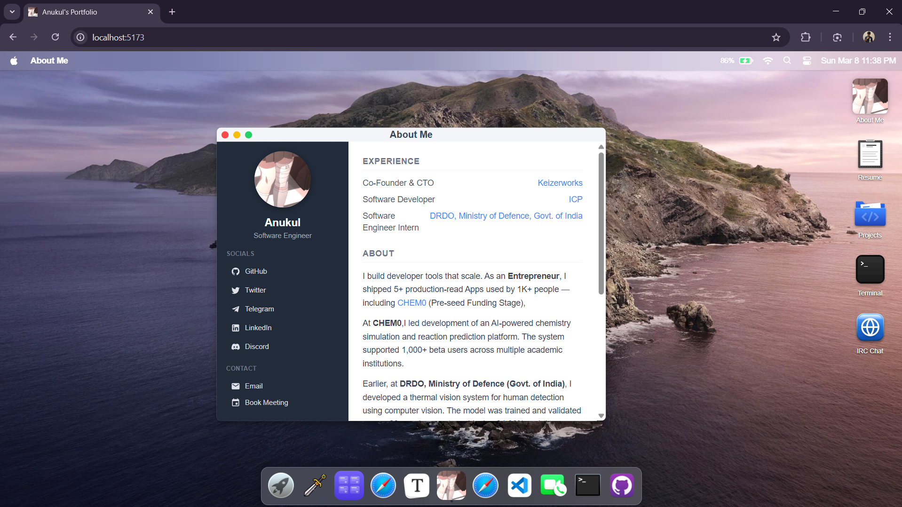

# macOS-Portfolio

> Anukul's portfolio website simulating macOS's GUI — [anukul.xyz](https://anukul.xyz)




## Tech Stack

- **React 18** + **TypeScript** — UI framework
- **Vite 5** — build tool with HMR
- **UnoCSS** — atomic CSS engine (attributify mode)
- **Zustand** — lightweight state management
- **Framer Motion** — animations and transitions
- **react-rnd** — draggable + resizable windows
- **Gun.js** — decentralized real-time database (IRC chat)
- **Milkdown** — markdown editor (Typora app)
- **Express** — local Gun relay server

## Project Structure

```
playground-macos/
├── public/
│   ├── img/                  # app icons, site favicons, UI assets
│   ├── logo/                 # profile picture / favicon
│   ├── music/                # background music files
│   └── manifest.json
├── dist/
│   └── markdown/             # markdown files for Anukul app
├── src/
│   ├── components/
│   │   ├── apps/             # all app components
│   │   │   ├── AboutMe.tsx
│   │   │   ├── Projects.tsx
│   │   │   ├── Resume.tsx
│   │   │   ├── IRCChat.tsx
│   │   │   ├── Safari.tsx
│   │   │   ├── Terminal.tsx
│   │   │   ├── VSCode.tsx
│   │   │   ├── FaceTime.tsx
│   │   │   ├── Typora.tsx
│   │   │   └── Anukul.tsx
│   │   ├── dock/             # dock bar components
│   │   ├── menus/            # top menu bar (Apple, Wifi, Battery...)
│   │   ├── AppWindow.tsx     # draggable/resizable window wrapper
│   │   ├── DesktopIcons.tsx  # desktop shortcut icons
│   │   ├── Launchpad.tsx     # app grid launcher
│   │   └── Spotlight.tsx     # search overlay
│   ├── configs/              # app definitions, user data, websites
│   ├── hooks/                # custom React hooks
│   ├── pages/                # Login + Desktop pages
│   ├── stores/               # Zustand state stores
│   ├── styles/               # CSS files
│   ├── types/                # TypeScript type definitions
│   └── utils/                # helper functions
├── gun-relay.cjs             # local Gun.js WebSocket relay
├── index.html
├── vite.config.ts
├── unocss.config.ts
└── package.json
```

## Usage

```bash
# install dependencies
pnpm install

# start dev server (relay + vite)
pnpm dev

# build for production
pnpm build

# preview production build
pnpm serve
```

## Deployment

Deploy to Vercel — just connect the repo and it auto-detects Vite.

> **Note:** The IRC Chat relay (`gun-relay.cjs`) only runs locally. For production, deploy the relay separately or use a hosted Gun peer.

## License

[MIT](./LICENSE) © Anukul
